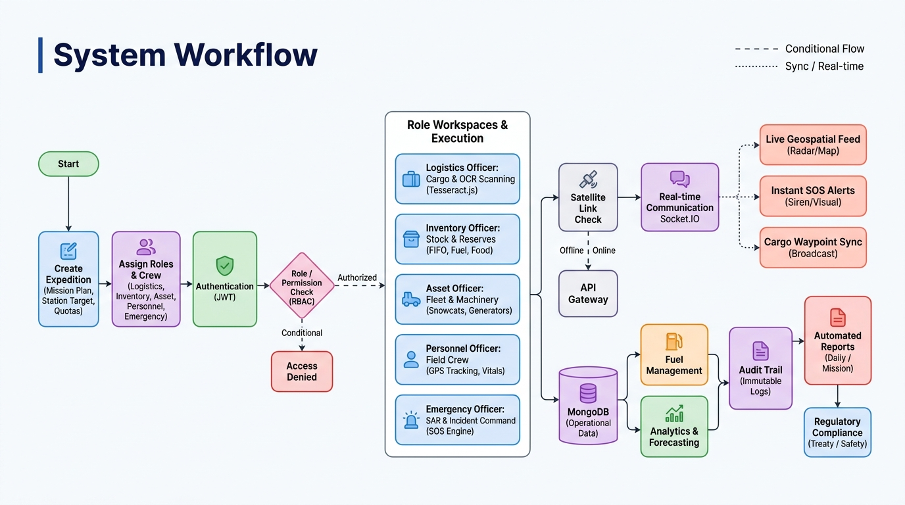

# POLARIS: System Architecture & Workflow Specification
**Platform:** POLARIS (Polar Expedition Mission Control & Logistics Platform)  
**Problem Statement ID:** SIH26062 (Ministry of Earth Sciences / NCPOR)  
**Standard:** Enterprise Polar Expedition Management & Resilience Architecture

---

## 1. Master Operational Lifecycle & System Workflow

The architecture of POLARIS follows the real-world operational lifecycle of polar missions:

> **1. Make Expedition ➔ 2. Add Roles & Assign Crew ➔ 3. Authenticate & Verify Permissions ➔ 4. Roles Execute Domain Work ➔ 5. Satellite Resilience & Real-Time Sync ➔ 6. Governance & Compliance**

### Native Mermaid Workflow Diagram

```mermaid
%%{init: {
  'theme': 'base',
  'themeVariables': {
    'primaryColor': '#EFF6FF',
    'primaryBorderColor': '#3B82F6',
    'primaryTextColor': '#1E293B',
    'lineColor': '#64748B',
    'fontFamily': 'Inter, system-ui, sans-serif'
  }
}}%%

flowchart LR
    classDef startNode fill:#ECFDF5,stroke:#10B981,stroke-width:2px,color:#065F46,rx:20,ry:20;
    classDef blueCard fill:#EFF6FF,stroke:#3B82F6,stroke-width:2px,color:#1E3A8A,rx:8,ry:8;
    classDef purpleCard fill:#F5F3FF,stroke:#8B5CF6,stroke-width:2px,color:#4C1D95,rx:8,ry:8;
    classDef cyanCard fill:#F0F9FF,stroke:#06B6D4,stroke-width:2px,color:#0E7490,rx:8,ry:8;
    classDef amberCard fill:#FFFBEB,stroke:#F59E0B,stroke-width:2px,color:#92400E,rx:8,ry:8;
    classDef greenCard fill:#ECFDF5,stroke:#10B981,stroke-width:2px,color:#065F46,rx:8,ry:8;
    classDef pinkCard fill:#FFF1F2,stroke:#F43F5E,stroke-width:2px,color:#9F1239,rx:8,ry:8;
    classDef redCard fill:#FEF2F2,stroke:#EF4444,stroke-width:2px,color:#991B1B,rx:8,ry:8;
    classDef dbNode fill:#F5F3FF,stroke:#8B5CF6,stroke-width:2px,color:#4C1D95;

    Start([Start]):::startNode
    CreateExp["Create Expedition<br/><b>(Mission Plan, Station Target, Quotas)</b>"]:::blueCard
    AssignRoles["Assign Roles & Crew<br/><b>(Logistics, Inventory, Asset, Personnel, Emergency)</b>"]:::purpleCard
    Auth["Authentication<br/><b>(JWT)</b>"]:::greenCard
    RBAC{"Role / Permission<br/>Check (RBAC)"}:::pinkCard
    AccessDenied["Access Denied"]:::redCard

    subgraph Workspaces["Role Workspaces & Execution"]
        Logistics["Logistics Officer:<br/><b>Cargo & OCR Scanning (Tesseract.js)</b>"]:::blueCard
        Inventory["Inventory Officer:<br/><b>Stock & Reserves (FIFO, Fuel, Food)</b>"]:::blueCard
        Assets["Asset Officer:<br/><b>Fleet & Machinery (Snowcats, Generators)</b>"]:::blueCard
        Personnel["Personnel Officer:<br/><b>Field Crew (GPS Tracking, Vitals)</b>"]:::blueCard
        Emergency["Emergency Officer:<br/><b>SAR & Incident Command (SOS Engine)</b>"]:::blueCard
    end

    SatLink["Satellite Link Check"]:::cyanCard
    IndexedDB[("IndexedDB<br/><b>(Offline Storage)</b>")]:::purpleCard
    APIGateway["API Gateway"]:::blueCard

    Realtime["Real-time Communication<br/><b>Socket.IO</b>"]:::purpleCard

    subgraph Feeds["Live Feeds & Broadcasts"]
        GeoFeed["Live Geospatial Feed<br/><b>(Radar/Map)</b>"]:::pinkCard
        SOSAlerts["Instant SOS Alerts<br/><b>(Siren/Visual)</b>"]:::pinkCard
        WaypointSync["Cargo Waypoint Sync<br/><b>(Broadcast)</b>"]:::pinkCard
    end

    Mongo[("MongoDB<br/><b>(Operational Data)</b>")]:::purpleCard
    Fuel["Fuel Management"]:::amberCard
    Analytics["Analytics & Forecasting"]:::greenCard

    subgraph Governance["Governance & Intelligence"]
        Audit["Audit Trail<br/><b>(Immutable Logs)</b>"]:::purpleCard
        Reports["Automated Reports<br/><b>(Daily / Mission)</b>"]:::pinkCard
        Compliance["Regulatory Compliance<br/><b>(Treaty / Safety)</b>"]:::blueCard
    end

    Start --> CreateExp
    CreateExp --> AssignRoles
    AssignRoles --> Auth
    Auth --> RBAC
    RBAC -.->|"Unauthorized"| AccessDenied
    RBAC -->|"Authorized"| Workspaces

    Workspaces --> SatLink
    SatLink -.->|"Offline"| IndexedDB
    SatLink -->|"Online"| APIGateway

    Workspaces --> Realtime
    Realtime -..-> GeoFeed
    Realtime -..-> SOSAlerts
    Realtime -..-> WaypointSync

    Workspaces --> Mongo
    Mongo --> Fuel
    Mongo --> Analytics
    Fuel & Analytics --> Audit
    Audit --> Reports
    Reports --> Compliance
```

### Flow Legend & Connector Semantics
| Symbol | Style | Semantic Meaning | Description |
| :--- | :--- | :--- | :--- |
| `──>` | Solid Arrow | **Deterministic Flow** | Standard synchronous sequence (Expedition setup $\rightarrow$ Role Assignment $\rightarrow$ Work Execution $\rightarrow$ Persistence). |
| `─ ─>` | Dashed Arrow | **Conditional Flow** | Security gate (Authorized vs Access Denied) and Network branch (Online API Gateway vs Offline IndexedDB outbox). |
| `····>` | Dotted Arrow | **Sync / Real-Time** | Persistent Socket.IO WebSocket streams broadcasting geospatial radar pings, emergency sirens, and waypoint notifications. |

---

## 2. Phase-by-Phase Technical Breakdown

### Phase 1: Expedition Inception ("Make Expedition")
- **Actor:** SuperAdmin (MoES / NCPOR Headquarters) or Expedition Commander.
- **Workflow (`/expeditions`):**
  - Defines the mission scope: Mission Code (e.g., `44-IAE`), Operational Season, Target Stations (Maitri, Bharati, Himadri).
  - Establishes operational dates (Departure, Resupply Windows, Wintering Period).
  - Configures the **Expedition Requirements Quota Matrix** (Jet A-1 fuel volumes, shelf-stable food rations, medical survival units, replacement spares).
  - Calculates dynamic mission readiness:
    $$\text{Readiness \%} = \frac{\text{Received + In-Transit Quantity}}{\text{Required Quantity}} \times 100$$

### Phase 2: Role Provisioning & Team Assignment ("Add Role")
- **Actor:** SuperAdmin & Station Commander.
- **Workflow (`/users`, `/personnel`):**
  - Team members are rostered and assigned explicit roles:
    1. **Logistics Officer:** Supply chain, ports, containers, waypoints.
    2. **Inventory Officer:** Station stock ledgers, daily burn rates, bunker reserves.
    3. **Asset Officer:** Polar vehicles, snowcats, generators, maintenance telemetry.
    4. **Personnel Officer:** Field safety, scientist tracking, vital signs, muster.
    5. **Emergency Officer:** SAR response, roll-calls, evacuation, SOS sirens.
- **Security Checkpoint:**
  - **Authentication (JWT):** Generates signed bearer tokens with role claims.
  - **RBAC Policy Interceptor:** Evaluates resource permissions. If unauthorized, access is immediately blocked with HTTP 403 `Access Denied`.

### Phase 3: Role-Based Execution ("Roles Do Their Work")
Once authenticated into their role-specific workspaces, each specialist executes their mission critical tasks:

1. **Logistics Officer ➔ Cargo & Manifest Management:**
   - **Tesseract.js Local OCR:** Client-side optical character recognition of ISO 6346 shipping containers and tamper seal barcodes in [ImageOcrUploader.jsx](file:///e:/POLARIS/client/src/components/ImageOcrUploader.jsx).
   - **5-Node Polar Supply Pipeline:** Advances cargo: `registered` $\rightarrow$ `port_staged` $\rightarrow$ `vessel_loaded` $\rightarrow$ `ice_shelf_dispatched` $\rightarrow$ `delivered_station`.
   - **One-Click Unpack Handshake:** Marking cargo delivered automatically creates receipts in Station Inventory.
2. **Inventory Officer ➔ Life-Support Stocks & Runout Prediction:**
   - Tracks 4 vital survival categories: Fuel (Jet A-1, Arctic Diesel), Food Rations, Medical/Life-Support, and Technical Spares.
   - Logs FIFO consumption and computes real-time **Days of Supply Remaining** before freeze-in runout risk.
3. **Asset Officer ➔ Polar Fleet & Life-Support Machinery:**
   - Monitors heavy tracked PistenBully 300 snowcats, Skidoos, Zodiacs, Bell 412 helicopters, and station Caterpillar 3406C generator sets.
   - Tracks engine run-hours, telemetry health flags, and scheduled maintenance countdowns.
4. **Personnel Officer ➔ Field Safety & Crew Monitoring:**
   - Tracks active science traverse parties and coordinates with GPS beacons.
   - Ingests physiological vitals (heart rate, SpO2, core body temperature) and manages field roll-call check-ins.
5. **Emergency Officer ➔ SAR Command & SOS Dispatch:**
   - Triggers and manages emergency incidents (Crevasse Fall, Man Down, Blizzard Stranding).
   - Coordinates automated muster roll-calls, siren alarms, and nearest-asset proximity dispatch.

### Phase 4: Operational Resilience (Satellite & Offline Layer)
- Field operations in Antarctica frequently experience satellite blackouts (blizzards, solar storms).
- **Satellite Link Check:**
  - **No Link (Offline Mode):** All actions are captured in client-side **IndexedDB (`polaris_offline_db` ➔ `outbox_queue`)** via [offlineQueue.js](file:///e:/POLARIS/client/src/lib/offlineQueue.js). The UI remains functional with optimistic updates.
  - **Link Available (Online Mode):** Replays outbox mutations via HTTPS to the Express **API Gateway** with automatic collision handling.

### Phase 5: Real-Time Event Stream (Socket.IO)
- Coordinates all station personnel via bi-directional WebSocket streams:
  - **Live Geospatial Feed:** High-frequency GPS marker telemetry rendered on the polar GIS radar map ([MapView.jsx](file:///e:/POLARIS/client/src/pages/MapView.jsx)).
  - **Instant SOS Alerts:** Visual crimson emergency HUD and client-side synthesized siren audio ([audio.js](file:///e:/POLARIS/client/src/lib/audio.js), [FloatingSOS.jsx](file:///e:/POLARIS/client/src/components/FloatingSOS.jsx)).
  - **Cargo Waypoint Sync:** Real-time push broadcasts when supplies arrive at transit milestones.

### Phase 6: Persistence, Governance & Intelligence
- **MongoDB (Operational Data):** Geospatial `2dsphere` indexed document collections.
- **Fuel Management Subsystem:** Tank levels, generator burn curves, and blizzard reserves.
- **Analytics & Forecasting:** Dynamic regression models predicting consumable depletion and mission readiness.
- **Audit Trail (Immutable Logs):** Cryptographic event logs tracking user, IP, entity changes, and timestamps for Antarctic Treaty compliance.
- **Automated Reports:** Daily Situation Reports (SITREP) and printable PDF briefs ([reportGenerator.js](file:///e:/POLARIS/client/src/lib/reportGenerator.js)).
- **Regulatory Compliance:** Adherence to the Madrid Protocol on Environmental Protection to the Antarctic Treaty.
